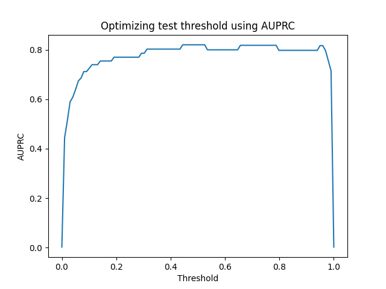

# Credit card fraud detection using Python

This repo contains the files for credit card fraud detection using Python on [this kaggle](https://www.kaggle.com/datasets/mlg-ulb/creditcardfraud) dataset. On this dataset, we will first train a model using Logistic Regression algorithm as a baseline and eventually improve it using few hyperparameters. Finally, we will create a model using XGBoost algorithm and try to optimize the same for minimizing the AUPRC which is the best metric for this problem and total cost of fraud. 

We also create a streamlit app which shows the total cost of fraud w.r.t to the fixed threshold.

